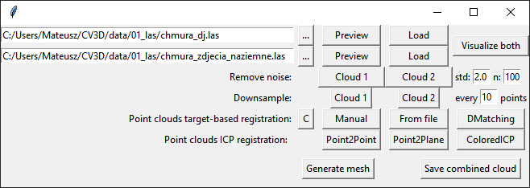

Computer Vision and 3D Data Processing course, Open3D final assignment

# Introduction

Following project is a part of "Computer Vision and 3D Data Processing" course conducted during 2020/2021 academic year
on Warsaw University of Technology - Mobile Mapping and Navigation Systems speciality on the faculty of Geodesy and
Cartography.

The program was required to perform point cloud processing including following steps:

1) The conversion of the point cloud - LAS into the O3D format.
2) The point cloud filtering using the statistical method - please propose input parameters.
3) The PCD downsampling - please suggest input parameters.
4) The initial PCD co-registration by the following methods (in the form of the 4x4 transformation matrix):

   4.1. By manual measurement of points on PCD and registration using the Target-based method.

   4.2. By importing the coordinates of the points from a text file and target-based orientation.

   4.3. By automatic keypoint detection, description and matching based on FPFH descriptor.

   4.4. Hierarchical ICP - ICP downsampling and registration.
5) The final registration of the point clouds using the ICP method together with the statistical analysis of the
   obtained results, i.e. the distance between the point clouds, max, min, avg values, statistical distributions, ...).
6) Combining two point clouds into one file (using the "+" operator).
7) Generating a 3D model in the structure of an irregular triangle mesh.

# Usage

### Starting the program

Firstly, run the *MBialek_project1.py* file.

You will see the program's main window which is GUI created in tkinter to simplify the usage of the functions by the
user.

### Loading and visualizing

Firstly you need to (1) ***load the point clouds*** using the **[Load]** button. The first row is resembling the
reference point clouds, the second one is the one we want to orient (register). You can navigate to the _.las_ file
via **[...]** button and next preview the chosen file by clicking **[Preview]**. It will not overwrite the current state
of clouds that are already loaded - just visualize the selected _.las_ file from the disk.

After choosing the right files and loading them into memory you can display both of them using **[Visualize both]**
button.

### Filtering

To use the (2) ***filtration function*** enter the desired value in the next row (Remove noise) "std:" **input field**
and then press **[Cloud 1]** or **[Cloud 2]** depending on the cloud you'd like to filter. It will perform noise
filtration using statistical method - for each point the average distance betwen the point and n of nearest neighboursis
calculated and then the points that are further than mean+/-std. parameter multiplied by standard deviation value are
filtrated. The default proposed values are n=100, std. (multiplier)=1.5.

### Downsampling

The next possibility is to use (3) ***point cloud downsampling*** which is loading only part of the cloud. In the case
of this program I decided to implement it as a uniform downsampling, which means every k-th point is loaded from each
cloud. The parameter k is changeable in the GUI.

### Registration

The main part of the program is (4) ***performing point clouds registration*** i.e. transforming one of them (oriented,
cloud 2), so it matches the first one (reference, cloud 1). There are numbers of methods to do this that have been
implemented in this project. Each algorithm returns the information about the resultant *fitness* (the bigger the
better, range between 0 and 1) and *RMSE* (the lower the better). Following methods are available:

- C (Correspondence)

Three points that were chosen arbitrary are used to calculate . This method is very fast, used for testing and works
ONLY for unchanged point clouds (without using downsample or outlier removal).

- Manual

The user picks min. 3 points on first (reference) point cloud using SHIFT+left mouse button, closes the window and then
the same points on the second one (being oriented). After closing the second window the transformation matrix is
calculated and transformed cloud is displayed.

- File

This method uses previously created text file containing corresponding points' coordinates. In each row there should be
6 values (XYZ for reference cloud and XYZ for the one being oriented) with spaces or tabs between them. Example of the
file (it is also attached to the project as *example_coords_manual.txt*):
> 310661.30	4683019.75	41.13	310543.05	4682954.20	37.17
>
> 310665.15	4683118.77	65.76	310580.65	4683044.35	63.15
>
> 310806.25	4683122.57	54.26	310715.15	4682997.55	51.07

- DMatching (feature descriptors matching)

Here the algorithm calculates Fast Point Feature Histograms (FPFH) for each point and then tries to match the
descriptors between the clouds (reference and oriented) in order to find the optimal transformation using RANSAC
algorithm. It is also possible to use FAST method implemented in Open3D, hwoever it is needed to be changed directly
inside *registration_module.py* file [lines: 151-157].

### Fine (ICP) registration

The fine registration can be performed via (5) ***ICP registration*** using one of three algorithms: PointToPoint,
PointToPlane or ColoredICP. Similarily, after the process we can obtain statistics of the resultant registration - *
fitness* and
*RMSE*.

### Combining and saving

Lastly, the user can (6) ***combine both clouds*** and (7) ***save the result*** as the new _.las_ file
using **[Save combined cloud]** button or save it as an irregular triangle mesh in _.ply_ format
using **[Generate mesh]**
.

___
Of course, you can also use each module (visualizing, outlier removal, downsampling, registration, mesh generating)
separately in *.py* scripts (without GUI). Example code is provided in
___test.py___.

# License

The code is distributed under the MIT license (see: [LICENSE.md](LICENSE.md)).

&copy; Mateusz Białek 2021